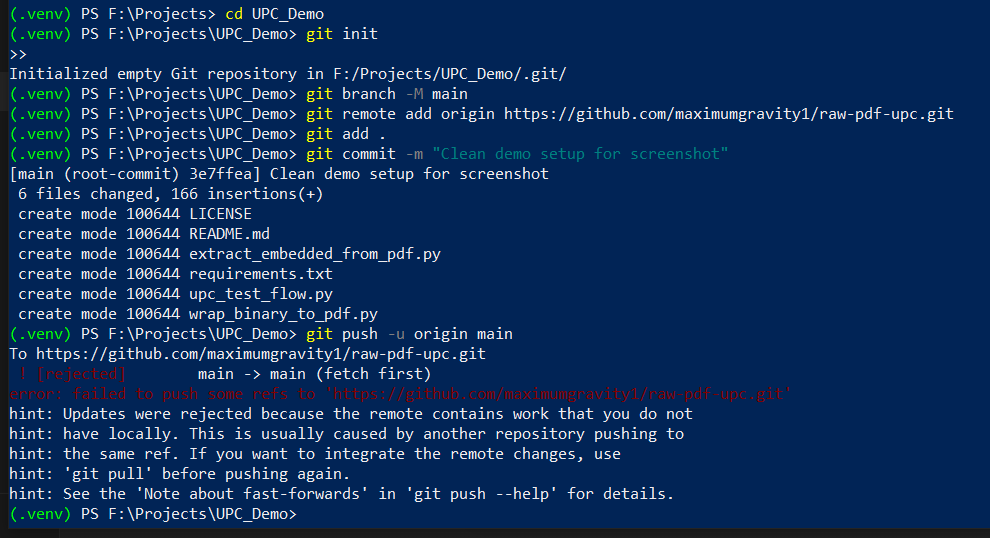
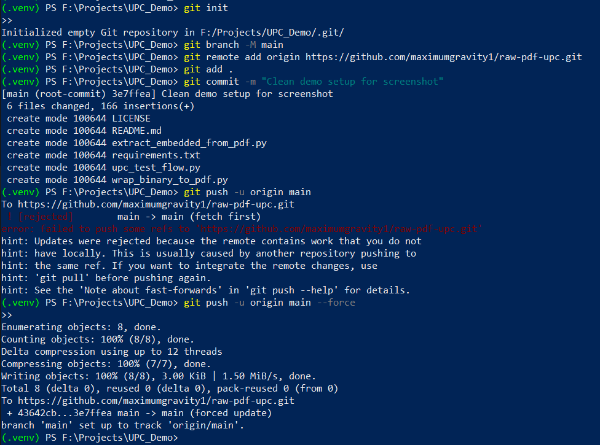

# RAW-to-PDF Universal Container (UPC)

A proof-of-concept tool for wrapping binary files (like `.RAW` camera images) inside PDFs with embedded metadata, then extracting them back with verification.

---

## Features
- Store RAW (or any binary) inside a valid PDF container.  
- Extract files with integrity check (SHA-256).  
- Demonstrates persistence, archiving, and recovery workflows.  
- Portable & simple — only Python + open libraries.  

---

## Quickstart
```bash
git clone https://github.com/maximumgravity1/raw-pdf-upc.git
cd raw-pdf-upc
python -m venv .venv
.\.venv\Scripts\activate
pip install -r requirements.txt
python upc_test_flow.py
```

---

## Git Push Demo

When pushing to GitHub, you may encounter a rejection if your local branch is behind the remote:  


After fixing with `git push --force`, the push succeeds:  

